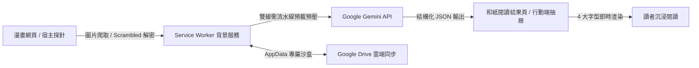

# 漫譯 V3.1.4 (Manga Translator V3.1.4) 🎌


**漫譯 V3.1.4** 是一款現代化、具備工業級穩定度與沉浸式和風美學的**跨平台漫畫與小說 AI 翻譯擴充功能**。  
支援電腦端（Chrome / Edge）與手機端（Edge Android），深度整合 Google Gemini 系列多模態模型，提供**流暢無阻的集中閱讀、左右/上下對話框對照、4 大經典字型切換、全書劇本預讀與 Google Drive 雙向雲端同步**！

---

## 🌟 核心功能特色 (Key Features)

### 🔤 1. 4 大經典字型即時切換系統（所見即所得）
* **0 毫秒極速切換**：在結果頁右上角自由切換 4 大經典風格字型，文字瞬間全局變換：
  * 🌸 **典雅宋體** (`Noto Serif TC` / 思源宋體) —— 文藝古風、戀愛、旁白與心聲
  * 🍡 **日漫圓體** (`Zen Maru Gothic` / 萌系圓體) —— 日常搞笑、校園喜劇（最貼近日漫原版對白感！）
  * 🪨 **源石黑體** (`GenSenGothic` / 復古鉛字黑體) —— 少年熱血、戰鬥冒險，兼具俐落好讀與紙本書質感
  * 📜 **古典楷體** (`DFKai-SB` / 標楷體) —— 武俠仙俠、忍術招式與豪邁對白
* **偏好記憶**：自動記錄您喜愛的字體，開啟任何新漫畫自動套用。

---

### 📱 2. 行動端 (Edge Android) 旗艦級完全體體驗
* **100vw 單頁精準滑動 (Horizontal Scroll-Snap)**：徹底修復多圖容器干擾，左右橫滑時精準 1 頁 1 頁切換，告別一次跳過整批的問題。
* **全域 Bottom Sheet 翻譯抽屜**：隨時由下往上滑出，直覺瀏覽當頁所有對話，橫向滑動卡片時抽屜內容自動無縫切換。
* **智慧懸浮按鈕 (FAB)**：滿版和風「漫」字按鈕，支援**自由拖曳、邊緣智慧吸附記憶、以及 2 秒閒置自動微縮靠邊膠囊**。

---

### 🧠 3. 雙階段工作流 (Two-Step Pipeline)
* **全書劇本通讀 + 劇情暫存精翻**：
  1. **階段一 (OCR 劇本提取)**：高速提取全書台詞並生成章節大綱與人物關係表。
  2. **階段二 (Vision 視覺精翻)**：結合全書前情提要與上下文，深度潤色每一頁漫畫對白。
* **避開審查利器**：當遇到敏感漫畫時，純文字雙階段能 100% 繞過圖片視覺審查！

---

### 🚫 4. 模型審查拒絕 (Prohibited Content) 專屬警示與自癒指引
* 當漫畫包含泳裝、沐浴或戰鬥畫面觸發 Google AI 的安全審查 (`SAFETY` / `BLOCKLIST`) 時：
* **首張卡片自動呈現 Prohibited 朱紅警示橫幅**，清楚告知原因並提供「再次翻譯」與「切換純文字模式」指引，絕不讓整批卡片莫名空白！

---

### ☁️ 5. Google Drive 專屬沙盒雙向雲端同步 (OAuth 2.0)
* **雙平台通用授權**：電腦端 Chrome / Edge 與手機端 Edge 均可**一鍵登入各自的 Gmail 帳號**。
* **自訂專屬詞庫同步**：自動在使用者個人的 Google Drive AppData 安全備份漫畫專用名詞、人名與術語對照表，換電腦/手機無縫延續。

---

### 💓 6. Chrome Alarms 雙重保活中繼器 (SW Keep-Alive Guardian)
* 透過 Chrome 官方 Alarms API + 內部 15 秒心跳，徹底杜絕 Manifest V3 Service Worker 5 分鐘強制休眠斷線問題，長篇長條漫 100+ 頁翻譯依然穩如泰山。

---

## 🏗️ 技術架構一覽 (Architecture)



| 模組 | 核心技術與設計亮點 |
| :--- | :--- |
| **建置系統** | Vite 5 + `@crxjs/vite-plugin` 模組化打包 |
| **圖片解密** | 支援 Canvas 解密還原圖層優先擷取，破譯 DOM 碎片拼接之圖片混淆 (DRM) |
| **流水線** | 雙緩衝管線預載預壓 (Pipeline Prefetching) + 非同步圖片解碼 (`decoding="async"`) |
| **字型架構** | 雲端 CDN 鏡像 + 本機字體優先 Fallback，套件極致超輕量（1.15MB） |
| **保活機制** | Chrome Alarms 雙重系統鬧鐘 + 心跳輪詢保活 |
| **隱私防護** | 無痕視窗 (Incognito) 完全隔離，不留歷史紀錄、不自動同步雲端 |

---

## 📁 專案目錄結構 (Directory Map)

```
Manga-Translator-V3.0/
├── dist-v3/             # Vite 編譯產出（瀏覽器載入此目錄）
├── src/
│   ├── background/      # Service Worker、API 通訊 (translate-api.js)、詞庫管理
│   ├── content/         # 網頁探針、行動端懸浮按鈕 (mobile-main.js)、漫畫爬蟲
│   ├── reader/          # 和風閱讀器 (result.html/css/js, stream-reader.*)
│   ├── sidepanel/       # 桌機側邊欄控制台
│   ├── mobile/          # 行動端獨立設定與操作頁
│   ├── options/         # 選項設定頁面 (API Key、模型選擇、Prompt 配置)
│   └── utils/           # 狀態機 (state.js)、雲端同步 (sync.js)、常數與日誌
├── build-zip.js         # 商店上架 ZIP 自動動態打包腳本
└── vite.config.js       # Vite 建置配置
```

---

## 🚀 快速開始 (Quick Start)

### 1. 安裝依賴與編譯
```bash
# 安裝相依套件
npm install

# 執行生產環境編譯與 ZIP 打包
npm run build
npm run pack
```

### 2. 載入瀏覽器使用 (Unpacked Extension)
1. 開啟 Chrome 或 Edge，前往擴充功能管理頁面：
   * Chrome: `chrome://extensions/`
   * Edge: `edge://extensions/`
2. 開啟右上角的 **「開發者模式 (Developer Mode)」**。
3. 點擊 **「載入解壓縮的擴充功能 (Load Unpacked)」**，選擇專案根目錄下的 **`dist-v3`** 資料夾即可開始享受！

---

## 📜 授權協議 (License)

MIT License © 2026 Manga Translator Team
