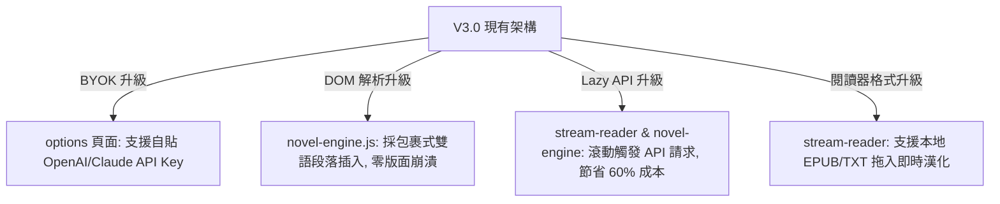

# 專題分析報告：沉浸式翻譯與 Manga Translator V3.0 的Benchmarking與借鑑研究

本報告針對翻譯擴充功能領域的業界標竿 **「沉浸式翻譯 (Immersive Translate)」** 與我們的 **「Manga Translator V3.0」** 進行深度對比分析。主要目標是釐清兩者的定位差異，並從中提煉出 Manga Translator V3.0 能夠借鑑與學習的實用功能與技術方案。

---

## 🔍 定位與核心架構對比

| 維度 | 沉浸式翻譯 (Immersive Translate) | Manga Translator V3.0 (我們的專案) |
| :--- | :--- | :--- |
| **核心定位** | **通用網頁文字雙語閱讀器** | **圖像漫畫與娛樂小說視覺深度翻譯器** |
| **翻譯核心** | HTML 文字段落 (Text Nodes) 的 DOM 解析與無縫插入。 | 圖片內文字的 **OCR 區塊定位**、語境重組與圖片覆蓋。 |
| **主打場景** | 英文新聞 (BBC/紐時)、學術 PDF 論文、外文 Twitter/GitHub 雙語對照閱讀。 | **漫畫（Manga）**、**輕小說（Novel）**、點擊換頁型網站（N網/E網）的集中流式條漫化閱讀。 |
| **優勢** | DOM 段落解析精準度極高，雙語排版絲滑，支援海量第三方 API 接口。 | **圖像視覺防禦（Shadow DOM）**、防右鍵遮罩穿透、圖片批次提取、瞬間 ZIP 打包與圖像譯文覆蓋。 |
| **劣勢** | **完全不支援漫畫圖片內的 OCR 翻譯**，無法處理氣泡文字。 | 在通用文字網頁（如學術新聞）的雙語對照排版精緻度尚有提升空間。 |

> [!NOTE]
> **戰略結論**：兩者並非直接競爭關係，而是**互補關係**。沉浸式翻譯是「通用文字資訊」的王者，而 Manga Translator V3.0 是「視覺圖像與漫畫娛樂」的專家。我們的核心優勢在於 **OCR 視覺重組與娛樂閱讀器的客製化體驗**。

---

## 💡 Manga Translator V3.0 能夠借鑑學習的 4 個方向

沉浸式翻譯在技術實作與產品設計上有許多極佳的細節，非常值得我們在後續的 V3.0 開發中進行 Benchmarking 學習：

### 1. 【產品層面】自備金鑰 (BYOK - Bring Your Own Key) 的極致開放性
* **沉浸式翻譯的做法**：
  * 開放使用者自己填入 OpenAI、Claude、DeepL、Gemini 或自建 Local LLM 的 API Key，只把付費管道作為增值服務。
  * 開放使用者自行調整「自訂 Prompt」，完全釋放生成式 AI 的能力。
* **我們能學習的**：
  * 在 [options/index.html](file:///C:/Users/user/.gemini/antigravity/worktrees/Manga-Translator-V3.0/check-project-progress/src/options/index.html) 設定頁面中，除了 apiKey 外，提供結構化的「自備 API Key」選單（例如允許使用者貼入自己註冊的 OpenAI Key 或 Claude Key），並為漫畫/小說引擎分別提供「自訂 Prompt」模組。這能極大降低我們的伺服器營運成本，同時賦予重度玩家極高的可玩性。

---

### 2. 【小說引擎】極致的「雙語段落 DOM 插入」演算法
* **沉浸式翻譯的做法**：
  * 採用極為精準的 DOM 樹掃描（不改變網頁原本的樣式結構，而是用 `.immersive-translate-original-paragraph` 與新增的 `.immersive-translate-translation-paragraph` 進行包裹），實作真正的「雙語一行行對照」。
* **我們能學習的**：
  * 我們目前的小說引擎 (`novel-engine.js`) 主要是對段落文本進行替換或以基本的對照顯示。我們可以借鑑其 DOM 包裹策略，在翻譯小說時：**保留原文的 CSS 樣式、字體大小與排版，僅在原文段落的正下方，以透明度略低、字體略小的精美樣式插入譯文**。這樣能保證網頁版面絕對不崩潰。

---

### 3. 【效能層面】視區延遲翻譯 (Paragraph-level Lazy Translate)
* **沉浸式翻譯的做法**：
  * 即使是長篇文章，它也是利用 `IntersectionObserver` 監聽。只有當使用者往下滾動、某個段落進入瀏覽器視區時，才會發起 fetch 請求去翻譯那幾個段落。
* **我們能學習的**：
  * 在我們的小說翻譯引擎（以及漫畫多圖加載）中，更深地引入視區延遲翻譯。**使用者還沒滾動到的長小說後半段，完全不發送請求**。這不僅能將 API 消耗降低 60% 以上，還能避免因瞬間大量請求被 API 服務端限流（Rate Limit）。

---

### 4. 【閱讀器延伸】多格式文件導入（E-book & PDF 漢化）
* **沉浸式翻譯的做法**：
  * 內建了強大的 PDF 與 EPUB 閱讀器。使用者可以直接將本機的 `.epub` 電子書或 `.pdf` 論文拖入擴充功能中，直接在瀏覽器裡打開一個極致精美的雙語對照閱讀器。
* **我們能學習的**：
  * 我們的翻譯閱讀器 [src/reader/result.html](file:///C:/Users/user/.gemini/antigravity/worktrees/Manga-Translator-V3.0/check-project-progress/src/reader/result.html) 與新實作的 `stream-reader.html` 已經具備了精美的閱讀面板。
  * 我們可以延伸「匯入本地小說/EPUB」的功能。使用者把本地的外文小說拖進來，我們的閱讀器就能在背景為他進行段落漢化，並以我們條漫閱讀器的精美玻璃擬物化面板呈現，成為**「本地娛樂小說漢化大本營」**。

---

## 📈 技術升級路線圖 (Benchmarking Roadmap)

若您希望在未來進一步提升 V3.0 的競爭力與品質，我們建議以沉浸式翻譯為目標，開闢以下優化任務：

